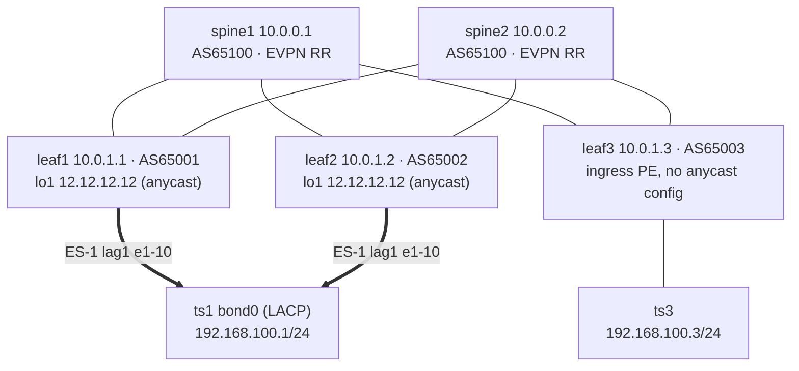

# EVPN Anycast Multi-Homing on SR Linux

EVPN all-active multi-homing normally relies on **aliasing**. Every egress PE attached to an
Ethernet Segment (ES) advertises per-EVI Ethernet A-D routes. The ingress PE then load-balances
in the overlay across the unicast VTEPs of those PEs. [draft-rabnag-bess-evpn-anycast-aliasing](https://datatracker.ietf.org/doc/draft-rabnag-bess-evpn-anycast-aliasing/)
proposes **EVPN Anycast Multi-Homing** as a simpler alternative for VXLAN fabrics:

- All PEs on the ES share one **anycast VTEP** IP and advertise it into the underlay.
- The per-ES A-D route carries an **Anycast** flag in the ESI Label extended community.
- Per-EVI A-D routes are **suppressed**.
- The ingress PE sends to a single destination, the anycast VTEP, and the **underlay ECMP**
  does the load balancing.
- The ingress PE needs **no new configuration**.

This lab shows that behaviour on SR Linux 26.7 using containerlab, and contrasts it with classic
aliasing on the same fabric.

## Topology



| Item | Value |
|---|---|
| Nodes | 5 x SR Linux `ghcr.io/nokia/srlinux:26.7.2` (type `ixr-d3l`), 2 x Linux `ghcr.io/srl-labs/network-multitool` |
| Underlay | eBGP over /31 links. Spines AS65100, leaves AS65001-65003. Only system `/32`s and the anycast `/32` are exported. `multipath ebgp maximum-paths 8` |
| Overlay | iBGP EVPN (`local-as 65500`), spines are route reflectors |
| Service | `mac-vrf-100`, VXLAN VNI 100, EVI 100, RT `target:65500:100` |
| ES-1 | ESI `00:11:11:11:11:11:11:00:00:01`, all-active, `type none`, anycast VTEP `12.12.12.12`, preference DF (leaf1 200, leaf2 100) |
| Hosts | ts1 dual-homed with an 802.3ad bond to leaf1 + leaf2. ts3 single-homed to leaf3 |

## Deploying the lab

The lab is deployed with [containerlab](https://containerlab.dev). `anycast-mh.clab.yml`
declaratively describes the topology, and every node boots with its startup config from
[`configs/`](configs).

```bash
# deploy the lab
containerlab deploy -t anycast-mh.clab.yml

# destroy the lab
containerlab destroy -t anycast-mh.clab.yml --cleanup
```

With the [VS Code containerlab extension](https://containerlab.dev/manual/vsc-extension/), open
the topology file and click **Deploy**. `anycast-mh.clab.yml.annotations.json` holds the node
layout for the extension's graph view. SR Linux needs about 1-2 minutes to boot. The hosts build
their bond and IP addresses through `exec` in the topology file. If `bond0` is missing on ts1, load
the host's bonding module (`sudo modprobe bonding`) and redeploy.

### clabernetes (Kubernetes)

[`c9s/anycast-mh-c9s.yaml`](c9s/anycast-mh-c9s.yaml) is the same lab for
[clabernetes](https://containerlab.dev/manual/clabernetes/) (one pod per node). It was generated
with `clabverter` from this repository, and contains a Namespace, the startup configs as
ConfigMaps, and the Topology resource.

```bash
helm upgrade --install --create-namespace --namespace c9s \
    clabernetes oci://ghcr.io/srl-labs/clabernetes/clabernetes
kubectl apply -f c9s/anycast-mh-c9s.yaml

# regenerate after changing the topology or configs
docker run --rm --user $(id -u) -v $(pwd):/clabernetes/work \
    ghcr.io/srl-labs/clabernetes/clabverter --stdout --naming non-prefixed \
    --topologyFile anycast-mh.clab.yml --destinationNamespace anycast-mh > c9s/anycast-mh-c9s.yaml
```

## Accessing the network elements

```bash
ssh admin@clab-anycast-mh-leaf1
ssh admin@clab-anycast-mh-spine1
docker exec -it clab-anycast-mh-ts1 bash
```

`scripts/verify.sh` walks through all the checks below
(`underlay | es | routes | forwarding | traffic | all`). `scripts/fail.sh` drives the
failure scenarios (`anycast-off | isolate | access-down | restore`).

## Configuration

### Egress PEs: the anycast Ethernet Segment

The only anycast-specific configuration is on leaf1 and leaf2. Here it is from leaf1; leaf2 is
identical except `preference-value 100`.

```
A:leaf1# info system network-instance protocols evpn
    ethernet-segments {
        bgp-instance 1 {
            ethernet-segment ES-1 {
                type none
                admin-state enable
                esi 00:11:11:11:11:11:11:00:00:01
                multi-homing-mode all-active
                interface lag1 {
                }
                df-election {
                    algorithm {
                        type preference
                        preference-alg {
                            preference-value 200
                            capabilities {
                                ac-df exclude
                            }
                        }
                    }
                }
                anycast-multi-homing {
                    ip-address 12.12.12.12
                }
            }
        }
    }
```

The YANG model enforces these rules:

- `anycast-multi-homing` requires `multi-homing-mode all-active` and `type none`.
- `ac-df include` is rejected on an anycast ES, because the per-EVI A-D routes that AC-influenced
  DF election depends on are suppressed. `ac-df` defaults to `include`, so you must configure the
  preference DF algorithm with `ac-df exclude`.

The anycast IP lives on its own loopback (`lo1`, `12.12.12.12/32`) in the default
network-instance. It is exported to the underlay by the same `UNDERLAY` policy as the system
address. The VXLAN source address stays the system IP. The anycast IP is only ever a
**destination**.

`lag1` on leaf1 and leaf2 uses the same LACP `system-id-mac 00:00:00:00:00:11` and
`admin-key 11`, so ts1 sees a single LACP partner across both links:

```
ts1# cat /proc/net/bonding/bond0
Bonding Mode: IEEE 802.3ad Dynamic link aggregation
	Partner Mac Address: 00:00:00:00:00:11
Slave Interface: eth1   MII Status: up   Aggregator ID: 1
Slave Interface: eth2   MII Status: up   Aggregator ID: 1
```

### Ingress PE

leaf3 is a plain EVPN-VXLAN leaf: an underlay, an overlay, and `mac-vrf-100`. It has no ES and
nothing anycast-specific. See [`configs/leaf3.cli`](configs/leaf3.cli).

## Verification

The outputs below are from a live run. Some wide tables have their columns trimmed; the unedited
versions are in [`outputs/`](outputs).

### Underlay: the anycast VTEP is an ECMP route

Each spine learns `12.12.12.12/32` from both leaf1 and leaf2 and installs both paths:

```
A:spine1# show network-instance default protocols bgp routes ipv4 prefix 12.12.12.12/32
Network: 12.12.12.12/32
Received Paths: 2
  Path 1: <Best,Valid,Used,>
    BGP next-hop    : 172.16.11.1
    Path            :  i [65001]
  Path 2: <Best,Valid,Used,>
    BGP next-hop    : 172.16.12.1
    Path            :  i [65002]
```

leaf3 receives it from both spines and load-balances across them:

```
A:leaf3# show network-instance default protocols bgp routes ipv4 summary
| u*>  | 10.0.1.1/32     | 172.16.13.0 |  i[65100, 65001] |
| u*>  | 10.0.1.1/32     | 172.16.23.0 |  i[65100, 65001] |
| u*>  | 10.0.1.2/32     | 172.16.13.0 |  i[65100, 65002] |
| u*>  | 10.0.1.2/32     | 172.16.23.0 |  i[65100, 65002] |
| u*>  | 12.12.12.12/32  | 172.16.13.0 |  i[65100, 65001] |
| u*>  | 12.12.12.12/32  | 172.16.23.0 |  i[65100, 65001] |
```

Both paths on leaf3 show AS path `[65100, 65001]`. Each spine advertises only its best path, so
the split between leaf1 and leaf2 happens at the spines, one hop later. That two-stage ECMP is
the underlay replacing overlay aliasing.

### Control plane: per-EVI A-D routes are suppressed

```
A:leaf3# show network-instance default protocols bgp routes evpn route-type 1 summary
+--------+---------------------+--------------------------------+------------+-----------+-----------+-------+
| Status | Route-distinguisher |              ESI               |   Tag-ID   | neighbor  | Next-Hop  | Label |
+========+=====================+================================+============+===========+===========+=======+
| u*>    | 10.0.1.1:100        | 00:11:11:11:11:11:11:00:00:01  | 4294967295 | 10.0.0.1  | 10.0.1.1  | -     |
| *      | 10.0.1.1:100        | 00:11:11:11:11:11:11:00:00:01  | 4294967295 | 10.0.0.2  | 10.0.1.1  | -     |
| u*>    | 10.0.1.2:100        | 00:11:11:11:11:11:11:00:00:01  | 4294967295 | 10.0.0.1  | 10.0.1.2  | -     |
| *      | 10.0.1.2:100        | 00:11:11:11:11:11:11:00:00:01  | 4294967295 | 10.0.0.2  | 10.0.1.2  | -     |
+--------+---------------------+--------------------------------+------------+-----------+-----------+-------+
4 Ethernet Auto-Discovery routes 2 used, 4 valid, 0 stale
```

Only per-ES routes (Tag `4294967295`) are present. There are no per-EVI (Tag `0`) routes. The
per-ES route carries the anycast flag. Its BGP next hop is still the advertising PE's own system
IP, not the anycast IP:

```
A:leaf3# show network-instance default protocols bgp routes evpn route-type 1 esi 00:11:11:11:11:11:11:00:00:01 detail
Route Distinguisher: 10.0.1.1:100
Tag-ID             : 4294967295
ESI                : 00:11:11:11:11:11:11:00:00:01
  Path 1: <Best,Valid,Used,>
    BGP next-hop          : 10.0.1.1
    Communities           : [target:65500:100, esi-label:0/All-Active/Anycast, bgp-tunnel-encap:VXLAN]
    RR Attributes         : Originator-ID 10.0.1.1, Cluster-List is [10.0.0.1]
```

ts1's MAC/IP route (RT-2) carries the ESI, which ties the MAC to ES-1:

```
A:leaf3# show network-instance default protocols bgp routes evpn route-type 2 summary
| u*> | 10.0.1.1:100 | 0 | AA:C1:AB:62:8F:DF | 0.0.0.0 | 10.0.0.1 | 10.0.1.1 | 100 | 00:11:11:11:11:11:11:00:00:01 |
```

### Forwarding: one destination, the anycast VTEP

With ts3 pinging ts1, leaf3 resolves ES-1 to a single VXLAN destination, `12.12.12.12`:

```
A:leaf3# show tunnel-interface vxlan1 vxlan-interface 100 bridge-table unicast-destinations destination
Ethernet Segment Destinations
+-------------------------------+-------------------+---------------+--------------+------------+--------------------+-----------------------------+
|              ESI              | Destination-index |   Next-Hop    | VTEP Address | Egress VNI | NextHop Oper-State | Number MACs (Active/Failed) |
+===============================+===================+===============+==============+============+====================+=============================+
| 00:11:11:11:11:11:11:00:00:01 | 1469852841812     | 1469852841809 | 12.12.12.12  | 100        | up                 | 1(1/0)                      |
+-------------------------------+-------------------+---------------+--------------+------------+--------------------+-----------------------------+
```

BUM traffic is unchanged. The flooding list still uses each PE's unicast VTEP, learned from the
Inclusive Multicast (RT-3) routes:

```
A:leaf3# show tunnel-interface vxlan1 vxlan-interface 100 bridge-table multicast-destinations destination
| VTEP Address | Egress VNI | Multicast-forwarding | NextHop Oper-State |
| 10.0.1.1     | 100        | BUM                  | up                 |
| 10.0.1.2     | 100        | BUM                  | up                 |
```

```
ts3# ping -c 40 -i 0.25 192.168.100.1
40 packets transmitted, 40 received, 0% packet loss, time 9892ms
```

## Anycast vs classic aliasing

`scripts/fail.sh anycast-off` deletes `anycast-multi-homing` from ES-1 on both egress PEs,
turning it into a classic all-active ES. Nothing changes on leaf3. Per-EVI A-D routes (Tag `0`,
label `100`) reappear, doubling the A-D route count:

```
A:leaf3# show network-instance default protocols bgp routes evpn route-type 1 summary
| u*>    | 10.0.1.1:100 | 00:11:11:11:11:11:11:00:00:01  | 0          | 10.0.0.1 | 10.0.1.1 | 100 |
| *      | 10.0.1.1:100 | 00:11:11:11:11:11:11:00:00:01  | 0          | 10.0.0.2 | 10.0.1.1 | 100 |
| u*>    | 10.0.1.1:100 | 00:11:11:11:11:11:11:00:00:01  | 4294967295 | 10.0.0.1 | 10.0.1.1 | -   |
| *      | 10.0.1.1:100 | 00:11:11:11:11:11:11:00:00:01  | 4294967295 | 10.0.0.2 | 10.0.1.1 | -   |
| u*>    | 10.0.1.2:100 | 00:11:11:11:11:11:11:00:00:01  | 0          | 10.0.0.1 | 10.0.1.2 | 100 |
| *      | 10.0.1.2:100 | 00:11:11:11:11:11:11:00:00:01  | 0          | 10.0.0.2 | 10.0.1.2 | 100 |
| u*>    | 10.0.1.2:100 | 00:11:11:11:11:11:11:00:00:01  | 4294967295 | 10.0.0.1 | 10.0.1.2 | -   |
| *      | 10.0.1.2:100 | 00:11:11:11:11:11:11:00:00:01  | 4294967295 | 10.0.0.2 | 10.0.1.2 | -   |
8 Ethernet Auto-Discovery routes 4 used, 8 valid, 0 stale
```

The ES destination now has two next hops, so the load balancing has moved back into the overlay:

```
A:leaf3# show tunnel-interface vxlan1 vxlan-interface 100 bridge-table unicast-destinations destination
| 00:11:11:11:11:11:11:00:00:01 | 1469852841812     | 1469852841808 | 10.0.1.1     | 100        | up                 | 1(1/0)                      |
|                               |                   | 1469852841806 | 10.0.1.2     | 100        | up                 |                             |
```

| | Anycast MH | Classic aliasing |
|---|---|---|
| A-D routes per ES on the ingress | 1 per PE (per-ES only) | 1 per PE per EVI + 1 per PE per ES |
| ESI Label extended community | `All-Active/Anycast` | `All-Active` |
| ES destination on the ingress | `12.12.12.12` | `10.0.1.1` + `10.0.1.2` |
| Who load-balances | Underlay ECMP | Overlay (EVPN aliasing) |
| Ingress config change | None | None |

With one EVI, classic aliasing adds 2 routes (one per PE). leaf3 shows them as 4 extra paths
because it receives each route from both route reflectors. With N EVIs on the ES, anycast saves
2 x N routes per ingress PE, which is the draft's scaling argument. `scripts/fail.sh restore`
re-enables anycast.

## Failure scenarios to try

| Command | What happens | What to look at |
|---|---|---|
| `fail.sh isolate` | leaf1 loses both uplinks | `12.12.12.12/32` is withdrawn via leaf1 only; the underlay converges onto leaf2 and leaf3's EVPN state does not change. Keep `ping -i 0.1` running from ts3 |
| `fail.sh access-down` | leaf1 loses its ES link | leaf1 keeps advertising the anycast `/32`, so spines still hash some flows to it. Check whether they are rerouted to leaf2 (the draft uses the anycast VTEP as the outer source as a loop-prevention marker) or dropped until BGP converges |
| `fail.sh restore` | Undo all of the above | |

Capture on any link with the containerlab VS Code extension (right-click an interface, then
**Capture**) to see the VXLAN outer header: destination `12.12.12.12`, source `10.0.1.3`.

## Notes and gotchas

- Expect a few `DUP!` ping replies right after the MACs age out (300 s). Until leaf3 learns ts1's
  MAC again over EVPN, it floods the echo requests as unknown unicast to leaf1 and leaf2. Both
  know the MAC locally and both deliver it, because DF filtering applies only to BUM traffic. The
  duplicates stop as soon as the RT-2 arrives.
- On `ixr-d3l`, `afi-safi ipv4-unicast multipath maximum-paths` is not available; use
  `multipath ebgp maximum-paths`.
- If deployment fails with `Failed to Setup IP tables ... No chain/target/match`, Docker's
  iptables chains were flushed (for example by a firewall reload). Restart Docker.

## Raw outputs

Full, unedited command outputs from a run of this lab are in [`outputs/`](outputs).

## References

- [draft-rabnag-bess-evpn-anycast-aliasing](https://datatracker.ietf.org/doc/draft-rabnag-bess-evpn-anycast-aliasing/)
- [RFC 7432: BGP MPLS-Based Ethernet VPN](https://www.rfc-editor.org/rfc/rfc7432)
- [RFC 8365: A Network Virtualization Overlay Solution Using EVPN](https://www.rfc-editor.org/rfc/rfc8365)
- [containerlab](https://containerlab.dev) · [clabernetes](https://containerlab.dev/manual/clabernetes/)
- Lab layout inspired by [jorabada/nokia-evpn-mcast-lab](https://github.com/jorabada/nokia-evpn-mcast-lab)
